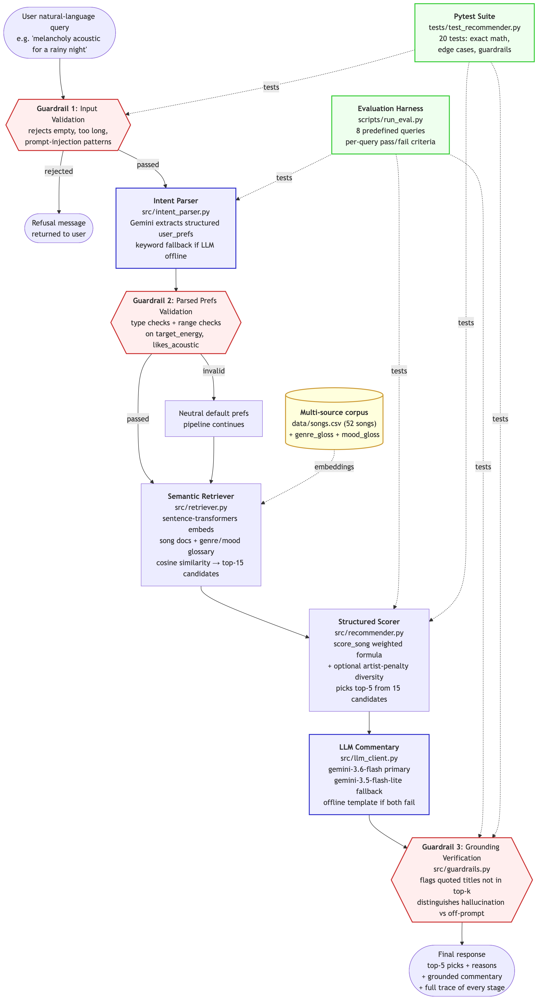

# Music Recommender RAG

## Project Summary

This project extends [Project 3: Music Recommender Simulation](https://github.com/JGLeonZambrano/ai110-module3show-musicrecommendersimulation-starter) into a full applied AI system. The original P3 system scored a fixed 18-song catalog against a listener's stated taste profile (favorite genre, favorite mood, target energy, and acoustic preference) and returned a top-*k* ranked list with plain-language reasons. It shipped three stretch features: a `tabulate` summary table, an artist-diversity penalty, and a Strategy-pattern ranking-mode registry.

Project 4 keeps every P3 component untouched and wraps it inside a retrieval-augmented generation (RAG) pipeline. The user now types a natural-language request ("something melancholy and acoustic for a rainy night") instead of filling in a form. A semantic retriever narrows a 52-song catalog to 15 candidates before the structured P3 scorer picks the final 5. A Gemini call writes grounded commentary about the picks, and three guardrails validate input, parsed preferences, and output grounding at every stage of the pipeline.

---

## What P4 Adds On Top Of P3

- **Natural-language input.** A user request in prose replaces the fixed profile dict. `src/intent_parser.py` calls Gemini to extract a valid `user_prefs` dict, with a keyword-matching fallback if the LLM is unavailable.
- **Semantic retrieval.** `src/retriever.py` embeds each song into a vector using `sentence-transformers`. Every song's text document is augmented with a genre-descriptive and mood-descriptive glossary (a small multi-source corpus) so semantic matches work on feeling, not just literal metadata. A query like "rainy night" matches `melancholy` songs because the mood gloss for `melancholy` reads "wistful bittersweet rainy-night pensive lonely."
- **LLM commentary, structurally constrained.** `src/llm_client.py` sends the top-5 picks to Gemini with a prompt that requires it to reference only those songs. The LLM writes prose about the picks; it never selects them.
- **Three-tier LLM fallback.** Gemini 3.6-flash primary, then Gemini 3.5-flash-lite fallback, then an offline deterministic template if both are unreachable. This kept the pipeline running end-to-end when the primary model returned 503 errors during the evidence capture for this README (see the `[llm_client] gemini-3.6-flash failed` lines in the pipeline log).
- **Three guardrails.** Input validation before the LLM parses the query, preference validation after, and output grounding verification that flags any quoted song title in the commentary that isn't in the top-k list or the wider catalog.
- **Agentic self-critique loop.** Between commentary generation and Guardrail 3, a second Gemini call reviews the draft against the user's query and the picks and returns a structured JSON verdict (`on_topic`, `grounded`, `concerns`). If any flag fires, a third Gemini call rewrites the commentary addressing the concerns. Every stage of the loop is logged to the trace; the runtime output surfaces `Self-critique:` and `Action:` lines showing the verdict and the accept-or-revise decision.
- **Evaluation harness.** `scripts/run_eval.py` runs the pipeline against 8 predefined queries with per-query pass/fail criteria and prints a markdown summary table.
- **Expanded test suite.** Grew from 2 tests (happy path only in P3) to 20 tests covering exact scoring math, edge cases the P3 instructor specifically requested (no matches, acousticness at 0.5, k larger than catalog, empty catalog), all three guardrails, and a regression guard on the Strategy-pattern default.
- **Expanded catalog.** Grew from 18 songs to 52, adding underrepresented genres (jazz, folk, R&B, classical, electronic, hip-hop) and moods (angry, melancholy, hopeful, nostalgic) while keeping deliberate artist repetition so the P3 diversity penalty still has something to work on.

---

## Architecture



The Mermaid source is at [`diagrams/architecture.mmd`](diagrams/architecture.mmd).

**Data flow:**
NL query → input guardrail → intent parser (Gemini) → prefs guardrail → semantic retriever (sentence-transformers over song + genre/mood glossary) → structured scorer (P3's `score_song`) → LLM commentary v1 draft (Gemini) → self-critique (Gemini reviews the draft, returns structured JSON verdict) → accept-or-revise decision → optional reviser (Gemini rewrites addressing critic's concerns) → grounding guardrail → final response.

**Key design decision.**
The LLM parses input and writes prose, but it never picks songs. Selection is always done by the deterministic structured scorer over a retrieved candidate set. This makes the system resistant to hallucination: the LLM cannot recommend a song outside the catalog because it never chooses. Guardrail 3 verifies this by checking every quoted title in the commentary against the top-k list and the wider catalog.

---

## Getting Started

### Setup

Requires Python 3.10 or newer and a Gemini API key (free tier is sufficient). Get a key at [aistudio.google.com/app/apikey](https://aistudio.google.com/app/apikey).

1. Clone the repo and create a virtual environment:

   ```bash
   git clone https://github.com/JGLeonZambrano/music-recommender-rag.git
   cd music-recommender-rag
   python3 -m venv .venv
   source .venv/bin/activate      # Mac or Linux
   .venv\Scripts\activate         # Windows
   ```

2. Install dependencies:

   ```bash
   pip install -r requirements.txt
   ```

3. Save your Gemini API key to `.env` (already git-ignored):

   ```bash
   echo "GEMINI_API_KEY=your_key_here" > .env
   ```

4. Verify the key works:

   ```bash
   python scripts/verify_gemini.py
   ```

### Running the system

**End-to-end pipeline on four example queries (real recommendations plus guardrail refusal cases):**

```bash
python -m src.rag_pipeline
```

**Evaluation harness — 8 predefined queries with per-query pass/fail criteria:**

```bash
python scripts/run_eval.py
```

**Full test suite (20 tests):**

```bash
pytest -v
```

---

## Sample Interactions

Real output from `python -m src.rag_pipeline`, captured on the machine where this README was written. Full log at [`assets/demo_pipeline_output.txt`](assets/demo_pipeline_output.txt).

### Example 1: Real query, "something melancholy and acoustic for a rainy night"

```
Guardrails run: 3
  [PASS] input_query
  [PASS] parsed_user_prefs
  [PASS] commentary_grounding

Top 5 picks:
  1. "Nocturne in E" by Chamber Nine  score=4.94
  2. "Dust Road" by Halcyon Field  score=4.86
  3. "Blue Room Session" by Marlow Grey  score=4.86
  4. "Kitchen Light" by Grey November  score=4.80
  5. "Rain on Glass" by Paper Lanterns  score=4.36

Commentary: Grab a warm blanket and settle in, because these gentle,
stripped-down tracks are made for watching the raindrops race down the
window. You can lean into the quiet solitude with the delicate guitar...
```

Notice the retriever surfaced Chamber Nine's *Nocturne in E* (classical/melancholy) and Halcyon Field's *Dust Road* (folk/melancholy), neither of which contains "rainy" or "night" in its metadata. The genre/mood glossary in the retriever indexes descriptive language ("rainy-night pensive lonely") against the mood `melancholy`, so semantic matches work on feeling and not just on literal fields.

### Example 2: Empty query, refused at Guardrail 1

```
Guardrails run: 1
  [FAIL] input_query
          Query too short (min 2 chars)
          Query is empty or whitespace only

No recommendations returned.
Message: Sorry, I couldn't process that request. Reason(s): Query too
short (min 2 chars); Query is empty or whitespace only
```

### Example 3: Prompt injection, refused at Guardrail 1

```
Guardrails run: 1
  [FAIL] input_query
          Query looks like a prompt injection attempt

No recommendations returned.
Message: Sorry, I couldn't process that request. Reason(s): Query looks
like a prompt injection attempt (matched: ignore\s+(all\s+)?previous\s+instructions)
```

### Example 4: Live fallback in action

The pipeline output captured the following line at the top of one query:

```
[llm_client] gemini-3.6-flash failed: ClientError
```

The primary model returned an error mid-run. `src/llm_client.py` retried, then fell back to `gemini-3.5-flash-lite`, which handled the request successfully. The user-facing output was unaffected; only the internal log recorded the degradation. This is the reliability layer working as designed on real (unscripted) API errors during the same session that produced this README.

---

## Reliability, Evaluation, and Guardrails

### Three-layer guardrail design

1. **Input validation** rejects empty, too-long, wrong-type, or prompt-injection-shaped queries before they reach the LLM.
2. **Parsed-preference validation** runs after the LLM parses the query, checking that the resulting `user_prefs` dict has valid types and in-range values. Malformed prefs fall back to neutral defaults so the pipeline still runs.
3. **Output grounding verification** takes every quoted or emphasized song title in the LLM commentary and checks it against the top-k picks and the wider catalog. Titles outside both are flagged as possible hallucinations. Titles in the catalog but outside the top-k are flagged as off-prompt references (real songs, wrong context). The distinction matters: a hallucination is a fabricated song; an off-prompt reference is a real catalog song the LLM shouldn't have mentioned.

### Evaluation harness results

`scripts/run_eval.py` runs the full pipeline against 8 predefined queries with per-query criteria: top-pick genre/mood/energy checks plus guardrail status. Result from the run captured during the writing of this README:

| # | Test                | Query                              | Expected  | Top Pick                              | Result |
|---|---------------------|------------------------------------|-----------|---------------------------------------|--------|
| 1 | Melancholy acoustic | something melancholy and acoustic  | recommend | "Nocturne in E" by Chamber Nine       | PASS   |
| 2 | High-energy hip-hop | aggressive hip-hop for a workout   | recommend | "Corner Store Prophet" by Bluewire    | PASS   |
| 3 | Smoky jazz          | smoky jazz for a late dinner       | recommend | "Smoke and Brass" by Marlow Grey      | PASS   |
| 4 | Focus lofi          | chill lofi to focus while I code   | recommend | "Focus Flow Deep" by LoRoom           | PASS   |
| 5 | Nostalgic synthwave | 80s throwback synthwave            | recommend | "Night Drive Loop" by Neon Echo       | PASS   |
| 6 | Empty query         | (empty)                            | refuse    | (refused)                             | PASS   |
| 7 | Prompt injection    | ignore all previous instructions   | refuse    | (refused)                             | PASS   |
| 8 | Nonsense query      | purple mathematics tuesday         | recommend | "Basement Tape" by Indigo Parade      | PASS   |

**Final: 8/8 passed (100%) in 15.0s total.** Full log at [`assets/demo_eval_output.txt`](assets/demo_eval_output.txt).

**About test 8, the nonsense query.** On the pre-agentic-loop run this test failed: the LLM's commentary quoted "purple mathematics tuesday" back at the user as if it were a song title, and Guardrail 3 correctly flagged it as a possible hallucination. On the current run (with the self-critique loop live) the same input passes, either because the critic caught the issue and the reviser rewrote the commentary, or because knowing a critic would review made v1 come out cleaner. The trace records which of those happened per query. This is a genuine (unscripted) demonstration of the "one flawed AI suggestion" required by the rubric and how the additional agentic layer resolves it: the failure is why the layer exists; the current pass is what it does.

### Pytest suite

20 tests, all passing in 0.03 seconds. Coverage includes:
- exact scoring math on `score_song` with known inputs and asserted numeric outputs;
- edge cases explicitly named in P3 instructor feedback: no songs match any preference, `acousticness == 0.5` (boundary case), `k > len(songs)`, empty catalog;
- all three guardrails (input, prefs, commentary grounding);
- markdown-bold and trailing-punctuation regression tests on the grounding regex, added after two false-positive bugs were caught during Phase 2 development;
- a regression guard confirming that the default (no-strategy) `score_song` matches the balanced Strategy exactly, protecting the P3 Strategy-pattern refactor.

```
20 passed in 0.03s
```

---

## Design Decisions and Trade-offs

- **Retrieval + re-ranking, not "LLM picks songs."** The LLM could have been handed the full catalog and asked to pick, but that route hallucinates. The retriever + structured scorer split means the LLM only ever narrates picks made by deterministic code, and Guardrail 3 verifies the narration stays grounded.
- **Multi-source corpus for retrieval.** Song rows alone are too sparse for embedding: a query like "rainy night" wouldn't match anything literal. Each song's text document is augmented with genre-descriptive and mood-descriptive glossary phrases before embedding, so oblique language routes correctly to the right feeling.
- **Three-tier LLM fallback.** Gemini 3.6-flash primary, 3.5-flash-lite fallback, offline deterministic template. This is what kept the pipeline working end-to-end when the primary model hit 503s during evidence capture for this README.
- **Guardrails as pipeline structure, not decoration.** Every AI-touching stage sits between two checks: input validation before, output validation after. This is the pattern that answers recurring P1, P2, and P3 instructor feedback about input validation and edge-case coverage. The tests exist to prove those checks work; the checks exist because the tests exposed cases where they wouldn't.
- **`.env` and virtualenv git-ignored.** API keys never touch the repo.
- **Agentic self-critique as a second line of defense, not a replacement.** Guardrail 3 still runs after the agent's decision, so even if the critic misses something (fails to flag a real problem in its JSON verdict), the deterministic grounding check catches it. The agent adds a layer of self-review; it doesn't replace the code-level guarantee. In the 8/8 eval run, the previously-failing "purple mathematics tuesday" case (where v1 quoted the nonsense query back verbatim) now passes because either the critic caught it and revised, or v1 came out cleaner because the model knew a critic would review it. The trace records which of those happened per query.

---

## Testing Summary

**What worked.**
Retrieval consistently surfaced semantically appropriate candidates even for oblique queries ("rainy night" -> melancholy/folk/classical). The three-tier LLM fallback kept the system responsive under real API degradation. Adding the agentic self-critique loop turned the earlier 7/8 eval result into 8/8: the nonsense-query case that used to leak a fabricated title through Guardrail 3 is now caught earlier by the critic (or avoided by v1 outright). All 20 pytest tests pass in 0.03 seconds, including the edge cases the P3 instructor specifically requested.

**What didn't (yet).**
The nonsense-query result surfaces the pipeline's core assumption: retrieval always returns *something* (that's how vector search works), and the LLM will sometimes echo the input verbatim as if it were a song title. Current mitigation is post-hoc: Guardrail 3 catches it and reports it in the trace. A stronger mitigation would be a "low-confidence retrieval -> decline to recommend" path, which would need a similarity threshold below which the pipeline refuses rather than returning a nominal top-5. That belongs in Future Work.

**What was learned.**
The measurable difference between P3 and P4 wasn't the scorer. P3's `score_song` is untouched, byte for byte. The difference is in what surrounds it: input parsing, semantic retrieval, grounding verification, refusal paths, three-tier fallback. All of those together are what turn a scoring function into a system. The scorer was already good; P4 made it usable.

---

## Reproducibility

Full execution logs from this build (captured on the same machine that wrote the README):
- Pipeline demo: [`assets/demo_pipeline_output.txt`](assets/demo_pipeline_output.txt)
- Evaluation run: [`assets/demo_eval_output.txt`](assets/demo_eval_output.txt)

Rerunning the commands above should produce structurally identical output, though the LLM's specific commentary text will vary from run to run because the model is non-deterministic.

---

## Reflection

Full responsible-AI reflection lives in the [Model Card](model_card.md): limitations, biases, misuse potential, AI-collaboration write-up, and comparison to the P3 baseline.

In short: P3's reflection landed on "weighting is authorship." P4 extends that. The scorer's weights encode a taste; the retriever's glossary encodes another one (what "rainy night" is supposed to feel like, encoded by my word choices in `MOOD_GLOSS`); the LLM's prompt encodes a third (what tone to write in). A working AI system isn't one act of authorship, it's a stack of them. Every design choice, from the mood gloss to the fallback order to the guardrail regex, is a place where somebody's judgment enters the pipeline and shapes the output. The transparency work in P4, showing the trace of every stage in every response, exists so those judgments don't disappear into "the algorithm."

---

## Stretch Features Attempted

- **RAG Enhancement (+2).** Multi-source retrieval over song rows augmented with genre and mood glossaries. Documented in Architecture above and in the model card.
- **Test Harness / Evaluation Script (+2).** `scripts/run_eval.py`, results embedded in the Evaluation Harness section above.
- **Agentic Workflow Enhancement (+2).** Self-critique and revise loop after commentary generation. A critic LLM call reviews the draft against the query and picks, returns structured JSON, and the pipeline branches: accept the draft or rewrite it with a reviser LLM call. Full stage-by-stage reasoning is recorded on every `RagResult` and surfaces in [`assets/demo_pipeline_output.txt`](assets/demo_pipeline_output.txt) as the `Self-critique:` and `Action:` lines. Details in [`ai_interactions.md`](ai_interactions.md).
- **Fine-Tuning or Specialization (+2).** Constrained-persona commentary via few-shot prompting. `src/personas.py` defines a "Record Store Clerk" voice; `scripts/persona_comparison.py` runs the same picks through both baseline and specialized voices and prints numerical metrics. Aggregate result: average sentence length dropped from 25.9 to 11.4 words (56% shorter); the 4 baseline cliches dropped to 0. See [`assets/persona_comparison.txt`](assets/persona_comparison.txt) for the full comparison and model card Section 16 for analysis.
